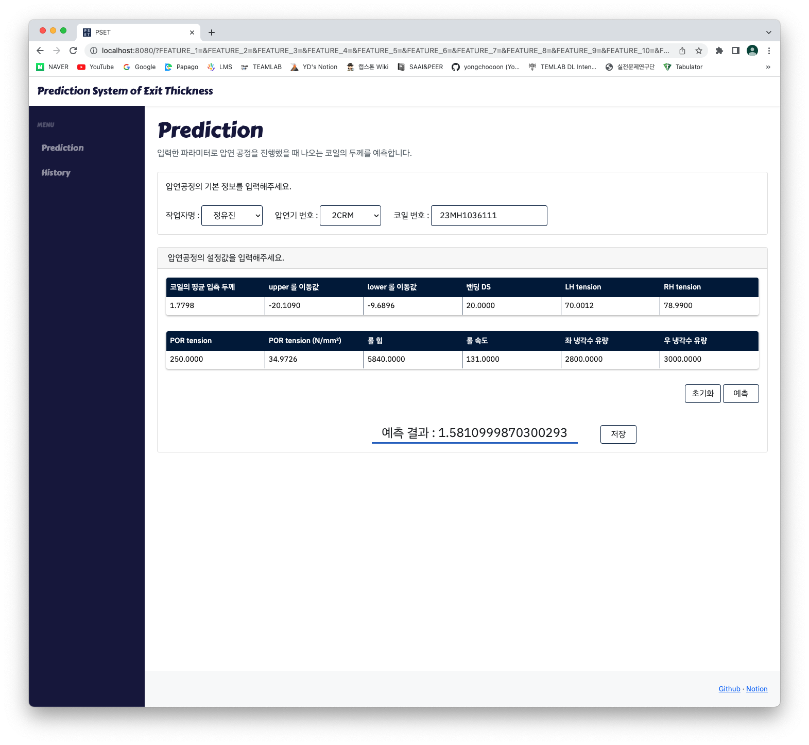
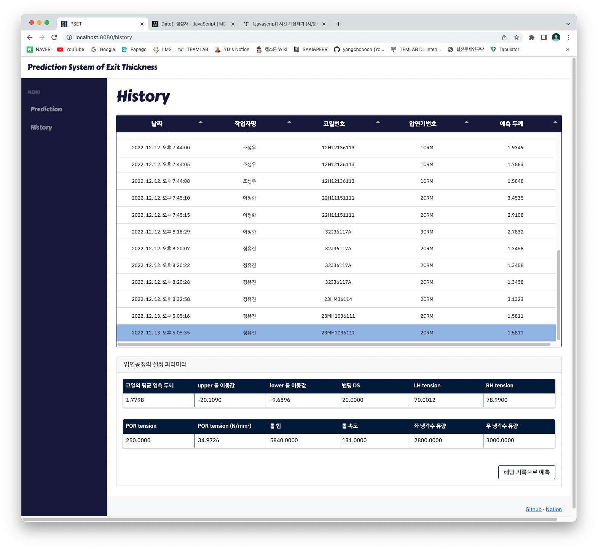

#  CapstoneDev
```bash
부경대학교 시스템경영안전공학부 캡스톤디자인 결과물
```
- Project Wiki : [Notion](https://www.notion.so/6cf3e2079ecd479388d1aad014948f02)

## PSET
> Prediction System of Exit Thickness
- 동국산업 압연공정 코일 두께 예측 시스템
- 기능 1 : 압연기 설정 파라미터를 입력하면 압연 과정을 거친 이후 코일의 두께를 예측
- 기능 2 : 예측하는 데 사용했던 압연기 설정 파라미터와 그 두께를 저장
- 기능 3 : 이전에 예측했던 기록을 불러와서 수정 및 재예측

### Prediction Page


### History Page
